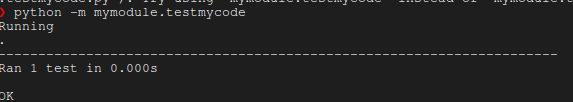

# mysoftware

## Motivation

Short description of
- problem in field (e.g. cancer)
- what is current solution (handdrawn segmentation)
- what this software does to solve it (sota segmentation)
- proposed impact (accelerated/accurate diagnosis)


## Status
[](FIXME) [](https://www.gnu.org/licenses/agpl-3.0)

## Table of contents
1. [Installation](#install)
2. [Test](#usage)
3. [Usage](#hpc)
4. [Cite](#cite)
5. [Reproducing results](#repro)
   1. [Datasets](#data)
   2. [Preprocessing](#script)
6. [FAQ](#faq)
7. [REMOVE ME ON TEMPLATE](#students)


<a name="installation"></a>
### Installation
#### Local
```bash
git clone <thisrepo>
# build instructions
```

##### Pip
```bash
pip install mysoftware
```

##### Conda
```bash
conda install mysoftware
```
or using the environment
```bash
conda env create --name myproject --file=myproject.yml
```
#### Container
##### Singularity
###### Building from recipes
```bash
sudo singularity build container/singularityrecipe.def
```
##### Released images
```bash
singularity pull repo:image.version
```

<a name="test"></a>
## Test
To run the tests ensuring the installation is valid, please run
```
python -m mymodule.testmycode
```
Which should result in


<a name="usage"></a>
## Usage
### Example snippets
Example inference on in silico data

```python
import seaborn as sns
import mysoftware.preprocessing as stk
import numpy as np
np.random.seed(42)
silico_data = stk.generate_insilico(args)
q = stk.infer(silico_data)
sns.boxplot(x='method', y='accuracy', data=q)
```

### Notebooks
See [notebooks/example.ipynb](notebooks/example.ipynb) for an example interactive workflow.

### API

See [docs](docs/docs.pdf) for the complete API documentation

<a name="cite"></a>
## Cite
```bibtext
[your citation here]
```

<a name="repro"></a>
## Reproducing our published results
### Data
#### In silico
See [mysoftware/insilico] on how to generate our in silico datasets.
For your convenience, this can be downloaded as well:
```bash
mkdir insilico && cd insilico
wget -O insilico.hdf5 https://mydatarepo/insilico.hdf5
```

#### Real world
```bash
mkdir mydata
wget -O dataset.hdf5 https://mydatarepo/dataset.hdf5
```
Ensure the checksums match
```bash
md5sum dataset.hdf5
```
should produce
```bash
4a4f224c7b7c871855fd307ae323be93 dataset.hdf5
```

#### Pre/post processing code
See [scripts/preprocessing.py](scripts/preprocessing.py) for the preprocessing scripts that configure the dataset and generate the plots

<a name="faq"></a>
## FAQ
#### Help I can't figure out how function5 works
Please create a [new issue](https://github.com/bencardoen/mial-hamarneh-repository-template/issues/new/choose) detailing concisely, yet complete what issue you encountered, in a reproducible way.


<a name="students"></a>
## FOR STUDENTS -- REMOVE ME

This a template for you to reuse in releasing software accompanying papers.
At a minimum, ensure your software runs in a reproducible way.
Place your (Python) code in [mymodule/mycode.py] (or different submodules).
Processing scripts ideally are separate from the modules

Instructions on how to create packages/containers:

[PIP](https://packaging.python.org/en/latest/tutorials/packaging-projects/)
[Conda](https://docs.conda.io/projects/conda-build/en/latest/user-guide/tutorials/build-pkgs.html)
[Singularity](https://singularity-docs.readthedocs.io/en/latest/)
